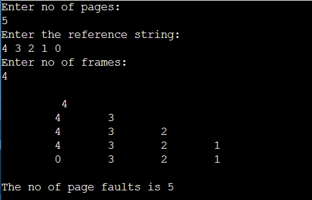

# OS-EX.10-IMPLEMENTATION-OF-PAGE-REPLACEMENT-ALGORITHMS

## AIM
To write a C program to implement Page Replacement technique using LRU.

## ALGORITHM

1. Start the program
2. Get the number of pages and their sequence from theuser
3. Get the number of available page frames from theuser.
4. In LRU replace the page that has not been used for the longest period oftime.
5. Compare all frames with incoming page-
6. If the incoming page is already available in page frame, set the match flag to indicate ‘no need of page replacement’.
7. If the incoming page is not available in all frames, then remove the page which has not been used for the longest period oftime.
8. Increment the ‘number of Page faults’ counter
9. Print the number of page faults.
10. Stop the program.
 
## PROGRAM
```
#include<stdio.h>
main()
{
int q[20],p[50],c=0,c1,d,f,i,j,k=0,n,r,t,b[20],c2[20];
printf("Enter no of pages: \n");
scanf("%d",&n);
printf("Enter the reference string: \n");
for(i=0;i<n;i++)
scanf("%d",&p[i]);
printf("Enter no of frames: \n");
scanf("%d",&f);
q[k]=p[k];
printf("\t\n\t %d\n",q[k]);
c++;
k++;
for(i=1;i<n;i++)
{
c1=0;
for(j=0;j<f;j++)
{
if(p[i]!=q[j])
c1++;
}
if(c1==f)
{
c++;
if(k<f)
{
q[k]=p[i];
k++;
for(j=0;j<k;j++)
printf("\t%d",q[j]);
printf("\n");
}
else
{
for(r=0;r<f;r++)
{
c2[r]=0;
for(j=i-1;j<n;j--)
{
if(q[r]!=p[j])
c2[r]++;
else
break;
}
}
for(r=0;r<f;r++)
b[r]=c2[r];
for(r=0;r<f;r++)
{
for(j=r;j<f;j++)
{
if(b[r]<b[j])
{
t=b[r];
b[r]=b[j];
b[j]=t;
}
}
}
for(r=0;r<f;r++)
{
if(c2[r]==b[0])
q[r]=p[i];
printf("\t%d",q[r]);
}
printf("\n");
}
}
}
printf("\nThe no of page faults is %d",c);
}
```
## OUTPUT


## RESULT
Thus the implementation of LRU page replacement is successfully executed.

